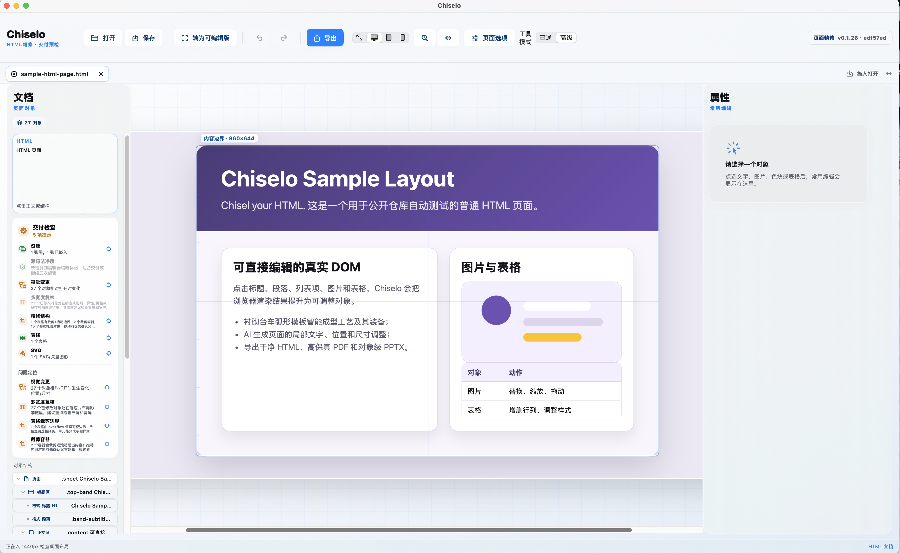
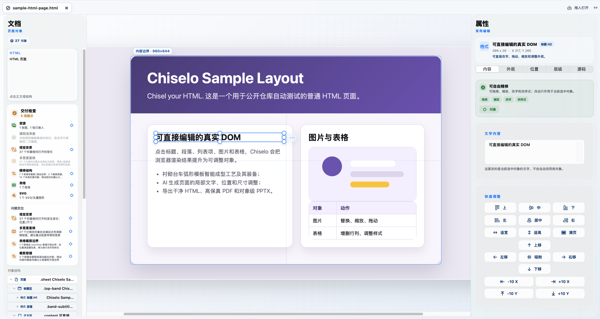
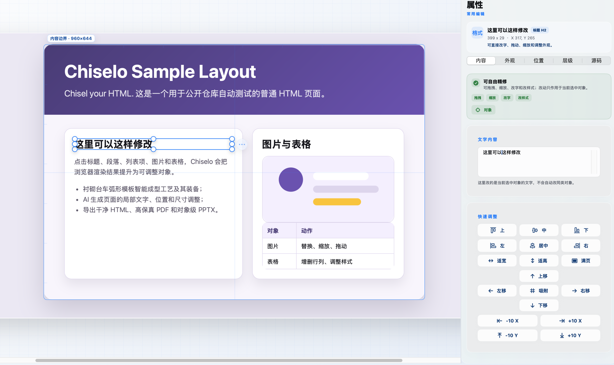
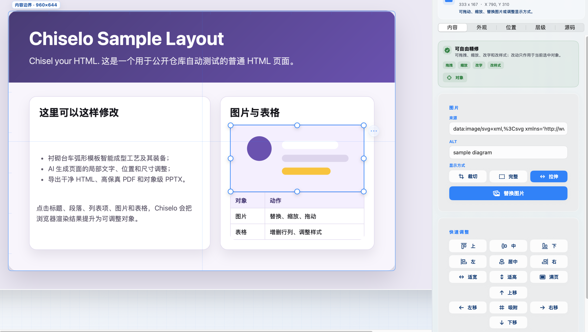

# Chiselo

[](https://github.com/JunZhaoNathan/Chiselo/actions/workflows/ci.yml)
[](https://github.com/JunZhaoNathan/Chiselo/releases/latest)
[](LICENSE)
[](docs/user/INSTALL.md)
[](https://chiselo.vellumloop.com/)

**Visual finishing for existing HTML.**

Chiselo is a native macOS editor for the moment after an HTML page already
exists. Open the original file, select what you see in the browser rendering,
make a precise visual change, review it, and deliver the original format.



Three-page workflow: open existing HTML, edit objects precisely, and deliver safely.







Chiselo edits existing HTML. It does not create website projects. When you edit
one element, other elements keep their position and appearance. You can adjust
text, images, tables, and styles for each object. During text entry, the
selection box and canvas view remain locked. You can replace images with local
files or embedded resources while keeping the original HTML delivery path.

## Why Chiselo

| Work | Chiselo approach |
| --- | --- |
| Find the right object | Select the rendered DOM object instead of searching source first. |
| Make a local correction | Edit text, images, tables, typography, color, spacing, geometry, and layers. |
| Keep control of the source | Preserve untouched HTML byte-for-byte; write HTML and local CSS with rollback-capable saving. |
| Review before delivery | Compare visual changes, inspect responsive widths, and run delivery checks. |
| Deliver the right format | Save HTML, export high-fidelity PDF, or use best-effort editable PPTX. |

## Get Started

1. Download the signed macOS build from [Latest Release](https://github.com/JunZhaoNathan/Chiselo/releases/latest).
2. Open an existing `.html`, `.htm`, or `.xhtml` file.
3. Select a visible object, make the adjustment, then review the change before saving or exporting.

Current release: `0.1.27` for Apple Silicon Macs. See the [installation guide](docs/user/INSTALL.md) and [usage guide](docs/user/USAGE.md).

## Product Boundary

Chiselo is designed for static pages, reports, dashboards, visual documents,
and conventional HTML generated by people or other tools. It is not a website
builder, hosting product, site manager, general-purpose IDE, or prompt-to-page
generator.

Scripts, forms, remote resources, cross-origin embeds, animations, canvas, and
framework runtimes are diagnosed as compatibility risks. Documents open in
static-safe mode by default; dynamic compatibility requires an explicit trusted
document choice. PDF and PPTX export retain the safe default unless that choice
has already been made.

## Documentation

- [Product strategy](docs/product/PRODUCT_STRATEGY.md): scope, primary workflow, and maintenance rules.
- [Install](docs/user/INSTALL.md) and [usage](docs/user/USAGE.md): end-user guides.
- [Architecture](docs/dev/architecture.md) and [testing](docs/dev/TESTING.md): how the app is built and verified.
- [Roadmap](docs/dev/ROADMAP.md) and [changelog](docs/dev/CHANGELOG.md): what is next and what changed.
- [Release notes](docs/releases/RELEASE_NOTES_0.1.27_PREVIEW.md): current packaged build details.

## Build From Source

Requirements: macOS 13+, Xcode command-line tools, Swift 5.9+, and Node.js for
the helper scripts.

```bash
swift run Chiselo
```

For the complete quality gate:

```bash
scripts/release-preflight.sh
```

## Project Layout

```text
Chiselo/       Native macOS app, document lifecycle, editor bridge, exporters
assets/        Repository media
docs/          Product, user, developer, and release documentation
examples/      Public HTML and project fixtures
scripts/       Regression, export, packaging, and release checks
```

## Contributing

Small, testable contributions are welcome. Start with the
[contributing guide](.github/CONTRIBUTING.md), then use the structured issue
forms for bugs and feature requests. Please include a minimal HTML file or
before/after export whenever it is safe to share.

## License And Brand

The source is publicly available under [CC BY-NC 4.0](LICENSE): copying,
modification, and sharing are permitted for non-commercial purposes with
attribution. Commercial use requires prior written permission. This is not an
OSI-approved open-source license. For commercial licensing, contact
[support@vellumloop.com](mailto:support@vellumloop.com).

The Chiselo name, icon, `Chisel your HTML.` tagline, and Vellumloop branding do
not transfer with the code. Forks and hosted services must use a distinct
identity; see the [Trademark Policy](TRADEMARKS.md).

Chiselo is made by [Vellumloop](https://vellumloop.com/).
